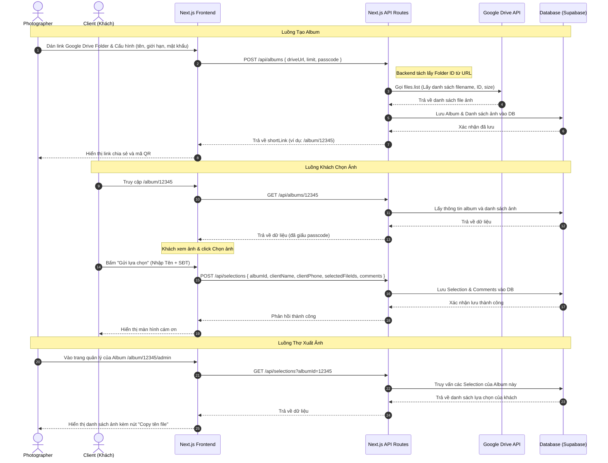

# Phân Tích Hệ Thống & Workflow: Ứng Dụng Chọn Ảnh Online

Tài liệu này phân tích chi tiết tính năng của trang web [chonanh.online](https://chonanh.online/) và đề xuất giải pháp công nghệ, kiến trúc hệ thống cùng quy trình phát triển (workflow) để xây dựng một sản phẩm tương tự.

---

## 1. Phân Tích Hệ Thống `chonanh.online`

### 1.1. Mục Tiêu của Ứng Dụng
Ứng dụng giúp đơn giản hóa quy trình giao dịch giữa **Nhiếp ảnh gia (Photographer)** và **Khách hàng (Client)** trong công đoạn chọn ảnh sau khi chụp.
*   **Vấn đề cũ:** Thợ chụp gửi link Drive, khách phải xem rồi gõ lại từng tên file (ví dụ: `DSC_1234.jpg`) gửi qua Zalo/Facebook. Rất dễ nhầm lẫn, mất thời gian của cả hai bên.
*   **Giải pháp mới:** Khách hàng tick chọn trực tiếp trên giao diện gallery đẹp mắt, viết ghi chú nếu cần. Sau đó, thợ chụp chỉ cần copy danh sách tên file sạch và dán vào Lightroom/Photoshop để lọc và chỉnh sửa.

### 1.2. Cách Thức Hoạt Động (Dưới góc nhìn người dùng)
1.  **Phía Photographer:**
    *   Tạo album mới bằng cách dán link thư mục Google Drive (ở chế độ chia sẻ công khai "Anyone with the link can view").
    *   Thiết lập: Tên album, giới hạn số lượng ảnh khách được chọn (ví dụ: tối đa 20 ảnh), và mã bảo mật (passcode) nếu cần.
    *   Nhận được một đường link rút gọn của album để gửi cho khách.
2.  **Phía Khách Hàng:**
    *   Truy cập link album, nhập mật khẩu (nếu có).
    *   Xem gallery ảnh xếp dạng lưới (grid layout) mượt mà, hỗ trợ phóng to (lightbox) để xem chi tiết.
    *   Nhấn Like/Chọn các bức ảnh ưng ý.
    *   Viết comment/ghi chú trực tiếp lên từng ảnh (ví dụ: "Bóp mặt", "Chỉnh màu sáng hơn").
    *   Xác nhận hoàn tất chọn ảnh bằng cách nhập tên và số điện thoại.
3.  **Phía Photographer (Xuất dữ liệu):**
    *   Xem danh sách các ảnh khách đã chọn.
    *   Copy danh sách tên file dạng chuỗi phân tách bởi dấu phẩy hoặc khoảng trắng (để paste thẳng vào thanh tìm kiếm của Lightroom).
    *   Tải file TXT/CSV chứa danh sách tên file kèm bình luận.

---

## 2. Kiến Trúc Công Nghệ Đề Xuất (ReactJS + NodeJS + Tailwind CSS)

Để phát triển ứng dụng Chọn Ảnh Online với trải nghiệm mượt mà, bảo mật cao và giao diện bắt mắt, kiến trúc tối ưu nhất là sử dụng **Next.js (ReactJS kết hợp Node.js)** cùng với **Tailwind CSS**.

### Lý do lựa chọn công nghệ:

1. **Frontend (ReactJS / Next.js):** 
   - **Trải nghiệm UX mượt mà:** Xử lý DOM ảo cực nhanh, giúp các hành động như cuộn danh sách ảnh vô tận (infinite scroll), phóng to ảnh (lightbox), Like và Bình luận diễn ra ngay lập tức mà không bị giật lag.
   - **Tối ưu hóa hình ảnh:** Next.js có sẵn component `<Image />` giúp tự động tối ưu dung lượng ảnh, Lazy Load hoàn hảo cho một gallery chứa hàng trăm bức ảnh.

2. **Backend (Node.js / Next.js API Routes):**
   - **Bảo mật API Key tuyệt đối:** Ứng dụng giao tiếp với Google Drive qua Backend Proxy. Node.js sẽ dùng Google API Key (lưu trong file `.env` ở Server) để gọi Google Drive API, sau đó trả dữ liệu sạch về cho Client. Khách hàng không thể đánh cắp API Key.
   - **Quản lý dữ liệu tập trung:** Xử lý nhanh các yêu cầu lưu trữ và truy xuất lựa chọn của khách từ Database (như PostgreSQL qua Supabase).

3. **Giao diện (Tailwind CSS):**
   - **Thiết kế linh hoạt và hiện đại:** Dễ dàng xây dựng giao diện Premium với phong cách Glassmorphism (kính mờ), bo góc mềm mại, đổ bóng tinh tế.
   - **Responsive hoàn hảo:** Code giao diện tương thích tốt với mọi thiết bị di động và máy tính bảng chỉ bằng các class tiện ích có sẵn.
   - **Hiệu suất cao:** Tailwind chỉ biên dịch ra file CSS chứa những class thực sự được sử dụng, giúp website load cực kỳ nhanh chóng.

---

## 3. Workflow Kỹ Thuật (Technical Workflow)

Dưới đây là sơ đồ luồng dữ liệu của ứng dụng khi sử dụng **Next.js & Supabase**:



---

## 4. Chi Tiết Kỹ Thuật Quan Trọng

### 4.1. Cách giao tiếp với Google Drive để lấy ảnh
Để lấy danh sách ảnh từ thư mục Google Drive mà photographer cung cấp, ta làm các bước sau:
1.  **Trích xuất Folder ID từ Link:**
    Một đường dẫn Google Drive có dạng: `https://drive.google.com/drive/folders/1a2b3c4d5e6f7g...`
    Ta dùng Regex để trích xuất chuỗi ID `1a2b3c4d5e6f7g...`.

2.  **Gọi API Google Drive:**
    Backend Node.js gọi REST API của Google:
    ```http
    GET https://www.googleapis.com/drive/v3/files?q='FOLDER_ID'+in+parents+and+mimeType+startsWith+'image/'+and+trashed=false&fields=files(id,name,mimeType,size,createdTime)&key=YOUR_GOOGLE_API_KEY
    ```
    *Lưu ý:* `YOUR_GOOGLE_API_KEY` chỉ cần tạo trên Google Cloud Console với quyền đọc (Read-only) và giới hạn chỉ gọi Drive API để bảo mật.

3.  **Hiển thị Ảnh trên Frontend:**
    Google Drive không cung cấp link ảnh trực tiếp dạng đuôi `.jpg` dễ dàng. Tuy nhiên, ta có thể tận dụng endpoint phân phối ảnh của Google (rất nhanh và hỗ trợ CDN):
    *   **Link ảnh gốc/Preview:** `https://lh3.googleusercontent.com/d/{FILE_ID}`
    *   **Link ảnh thumbnail tối ưu (ví dụ chiều rộng 400px để load nhanh):** `https://lh3.googleusercontent.com/d/{FILE_ID}=w400`
    *   **Link ảnh thumbnail nhỏ (ví dụ chiều rộng 150px):** `https://lh3.googleusercontent.com/d/{FILE_ID}=w150-h150-c` (cắt vuông)
    
    *Cách này giúp trang web load cực kỳ nhanh vì không phải tải ảnh gốc vài chục MB từ Drive.*

### 4.2. Cách copy danh sách ảnh vào Lightroom nhanh nhất
Nhiếp ảnh gia cần tìm nhanh các ảnh khách chọn trong Lightroom. Lightroom hỗ trợ tìm kiếm bằng cách dán danh sách tên file ngăn cách bởi dấu cách hoặc dấu phẩy.
*   **Ví dụ chuỗi export:** `_DSC0214 _DSC0225 _DSC0340 _DSC0512`
*   Trong Lightroom, Photographer chỉ cần dán chuỗi này vào thanh tìm kiếm (chọn chế độ "Filename" -> "Contains"), Lightroom sẽ lọc ra chính xác 4 bức ảnh này để chỉnh sửa.

---

## 5. Thiết Kế Cơ Sở Dữ Liệu (Database Schema) Gợi Ý

Dưới đây là cấu trúc bảng tối giản bằng PostgreSQL (Prisma ORM):

```prisma
// 1. Bảng lưu trữ Album
model Album {
  id          String      @id @default(uuid())
  driveFolderId String    // ID thư mục Google Drive
  name        String      // Tên album (VD: "Ảnh Cưới Tuấn Vy")
  limitCount  Int         // Giới hạn số ảnh khách được chọn (0 = không giới hạn)
  passcode    String?     // Mật khẩu truy cập album (nếu có)
  createdAt   DateTime    @default(now())
  
  images      Image[]     // Danh sách ảnh trong album
  selections  Selection[] // Lượt chọn của khách
}

// 2. Bảng lưu danh sách ảnh của Album (Được cào từ Drive về lưu cache để load nhanh)
model Image {
  id        String   @id // Google Drive File ID
  albumId   String
  album     Album    @relation(fields: [albumId], references: [id], onDelete: Cascade)
  name      String   // Tên file (VD: DSC_001.jpg)
  size      Int?     // Dung lượng file
}

// 3. Bảng lưu lựa chọn của khách hàng
model Selection {
  id          String   @id @default(uuid())
  albumId     String
  album       Album    @relation(fields: [albumId], references: [id], onDelete: Cascade)
  clientName  String   // Tên khách hàng
  clientPhone String   // Số điện thoại khách hàng
  selectedIds String[] // Mảng các Image ID được chọn (VD: ["id1", "id2"])
  comments    Json?    // Lưu trữ comment dưới dạng JSON: { "image_id_1": "Bóp mặt nhé", "image_id_2": "Màu này hơi tối" }
  createdAt   DateTime @default(now())
}
```

---

## 6. Kế Hoạch Triển Khai (Implementation Plan)

### Bước 1: Setup Môi Trường & Project
*   Khởi tạo dự án Next.js với Tailwind CSS và TypeScript: `npx create-next-app@latest`
*   Cài đặt Prisma và kết nối cơ sở dữ liệu Supabase (PostgreSQL).
*   Đăng ký Google Cloud Project, bật API Google Drive, tạo API Key.

### Bước 2: Xây dựng Backend API
*   API tạo Album: Nhận link Drive -> Tách ID -> Gọi API Google lấy danh sách ảnh -> Lưu vào Database.
*   API lấy thông tin Album: Trả về thông tin album kèm danh sách ảnh (ẩn passcode).
*   API gửi Lựa chọn: Lưu thông tin khách hàng, mảng ID ảnh đã chọn và comment vào DB.
*   API Admin: Lấy danh sách khách hàng đã chọn ảnh của album đó kèm tính năng export.

### Bước 3: Thiết kế Giao diện UI (Theo phong cách Premium Glassmorphism)
*   **Trang chủ:** Landing page giới thiệu ứng dụng, hướng dẫn sử dụng và nút "Bắt đầu ngay" (giống giao diện hiện tại của `chonanh.online`).
*   **Trang tạo Album (`/app`):** Form nhập link Drive, cấu hình số lượng ảnh tối đa, mật khẩu, và nút tạo link.
*   **Trang xem và chọn ảnh (`/album/[id]`):**
    *   Bảng nhập passcode (nếu album có cài mật khẩu).
    *   Giao diện Gallery dạng Masonry Grid hiển thị ảnh thumbnail mượt mà (dùng Lazy Load).
    *   Nút "Like/Chọn" nằm góc ảnh, kèm thanh đếm tiến trình (ví dụ: `Đã chọn: 5/12 ảnh`).
    *   Lightbox phóng to ảnh khi click vào, hỗ trợ xem ghi chú và viết bình luận cho từng ảnh.
    *   Popup điền thông tin người chọn (Tên, SĐT) để submit.
*   **Trang quản trị cho thợ (`/album/[id]/admin`):**
    *   Bảng danh sách các khách đã chọn ảnh.
    *   Xem chi tiết từng khách hàng chọn những tấm nào, bình luận ra sao.
    *   Nút copy nhanh danh sách tên file (để dán vào Lightroom).

### Bước 4: Kiểm thử & Deploy
*   Kiểm thử hiệu năng load ảnh khi album có từ 100 - 500 ảnh.
*   Deploy lên Vercel.
*   Cấu hình domain tùy chỉnh.

---

## Kết luận & Đề xuất tiếp theo

Bạn nên đi theo hướng **Next.js (ReactJS + Node.js fullstack)**. Nó sẽ giúp bạn:
1.  Bảo mật tuyệt đối Google API Key trên Backend.
2.  Tạo ra các hiệu ứng UI/UX mượt mà, chuyên nghiệp (như zoom ảnh, lazy load ảnh cực nhanh) - yếu tố quyết định để giữ chân các nhiếp ảnh gia khó tính.
3.  Dễ dàng phát triển thêm các tính năng nâng cao sau này (thanh toán, quản lý tài khoản thợ, gửi thông báo qua Telegram/Zalo khi khách chọn xong).

**Hãy phản hồi nếu bạn đã sẵn sàng bắt đầu thiết lập cấu trúc thư mục dự án và lập trình giao diện đầu tiên!**
